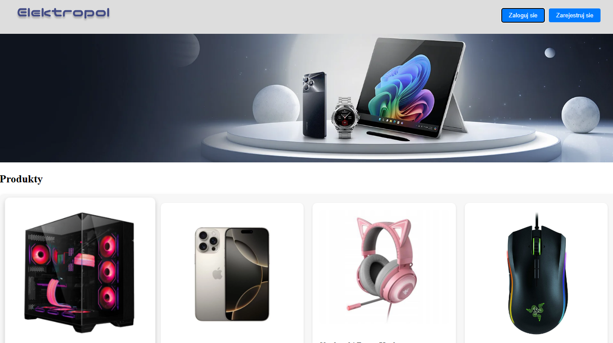
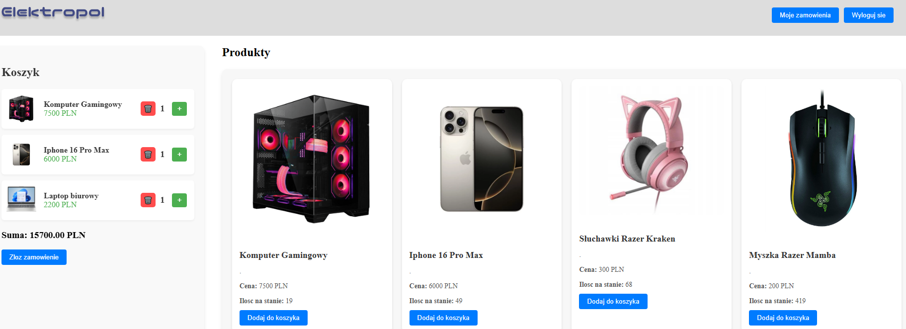

# 🛍️ Fullstack Express Store

Prosty sklep internetowy stworzony w ramach projektu edukacyjnego. Aplikacja typu fullstack z frontendem oraz backendem opartym o Node.js i Express. Dane przechowywane są w lokalnej bazie SQLite.

## 🔧 Funkcje

- Rejestracja i logowanie użytkownika
- Panel administracyjny (dodawanie / edycja / usuwanie produktów)
- Przeglądanie produktów
- Dodawanie produktów do koszyka
- Składanie zamówień
- Połączenie z bazą danych SQLite

## Zrzuty ekranu




## Technologie

- Backend: Node.js, Express.js, SQLite, Sequelize, bcrypt, jsonwebtoken
- Frontend: React, React Router DOM, axios
- Stylizacja i narzędzia: Tailwind CSS, ESLint

## Uruchomienie projektu

```bash
git clone https://github.com/patryk-bura/simple-ecommerce-js
cd simple-ecommerce-js
npm install
npm start
cd frontend
npm install
npm start
```

Aplikacja będzie dostępna pod adresem `http://localhost:3000`
Backend działa na adresie `http://localhost:5000`

## Uwaga

Projekt demonstracyjny, bez integracji z systemem płatności i bez zabezpieczeń na poziomie produkcyjnym.


